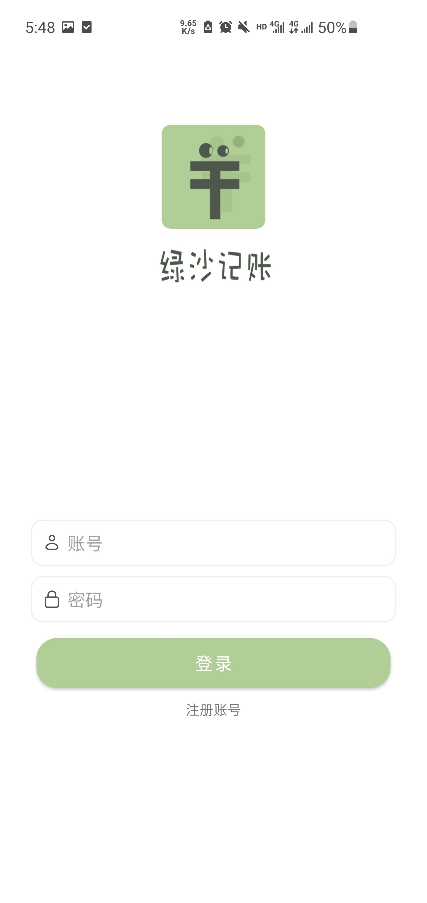
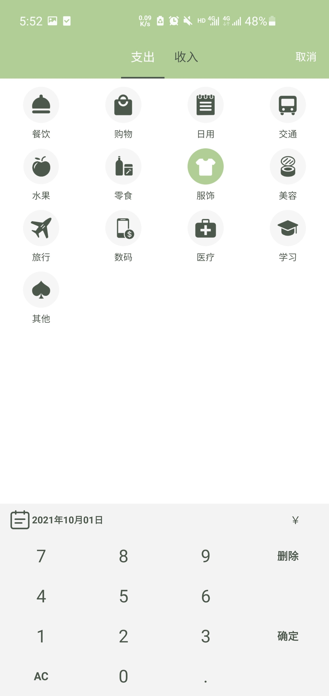
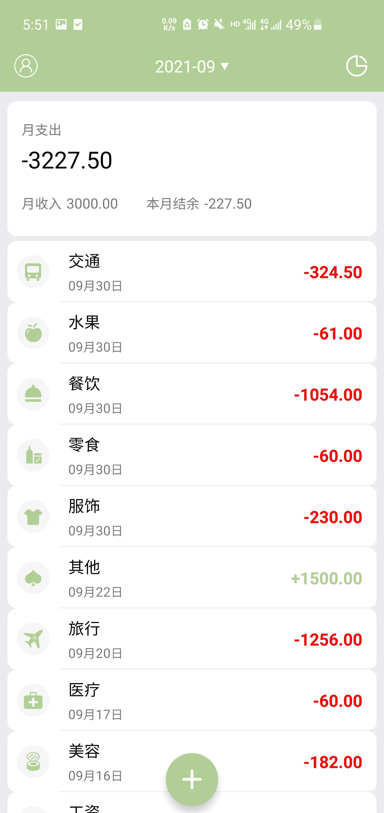
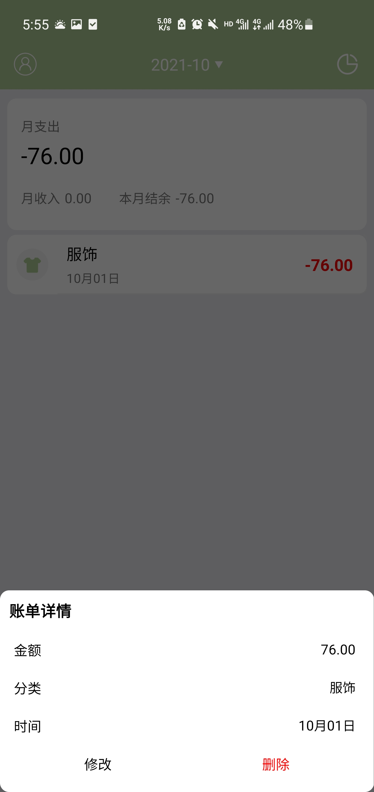
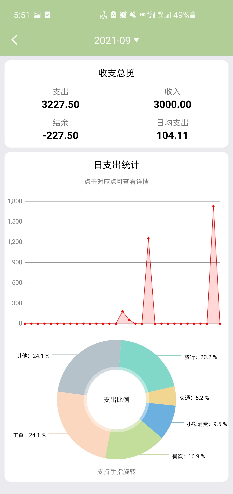

### 介绍

* 项目名称：绿鲨记账
* 项目用途：大三安卓实训项目
* 项目描述：基于Android与Django编写的记账软件
* 作者：Master，Joith_Hua，L_TiLer

### 基本功能

**用户登录模块**

- 注册登录信息：系统包括用户登录验证、注册账号、忘记密码
- 信息修改：用户可以对用户的个人信息进行信息修改

**账单列表显示模块**

- 账单筛选：按照月份筛选账单
- 查看账单：罗列该月每笔账单的日期、类型、金额
- 编辑账单：对选中账单可执行删除以及编辑操作

**记账模块**

- 选择记账分类：选择记录支出账单或者收入账单
- 记录账单信息：记录账单类型、账单金额、账单日期，账单备注

**账单统计模块**

- 账单统计：统计月收支总图以及结余、计算日均支出
- 图表分析：折线图——显示日收支金额；饼状图——显示月收支类别比例

### 效果展示

